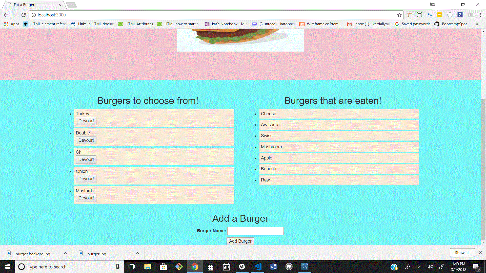
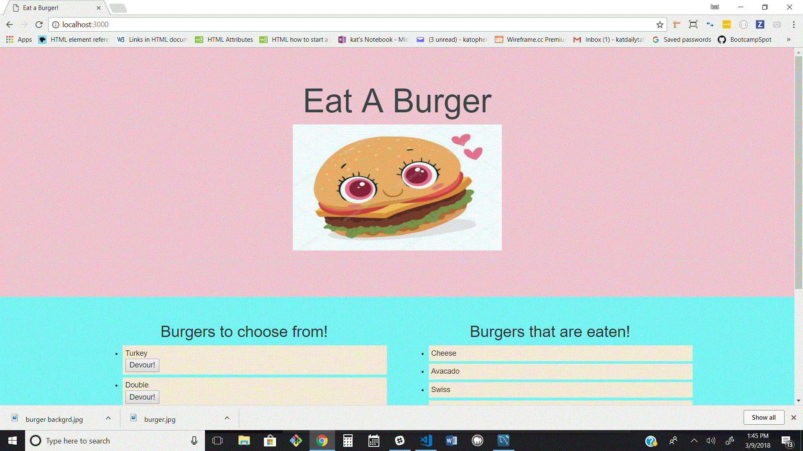

# Burger - Eat a Burger

## Overview
Burger is a web application designed to create and devour burgers.

### Utilising
* Node.js
* Express
* Body-Parser
* Various Routes
* API
* MySql
* Handlebars

# Using Burger
Users can add a burger by entering the kind of burger they want and clicking Add Burger button at the bottom.

The user can then devour the burger by clicking the devour button underneath the burger - this moves the burger to the list of eaten burgers.

Adding and devouring burgers also updates the database in mysql.

 This app is setup to listen on a Heroku default port.

 https://burgerheroku.herokuapp.com/
